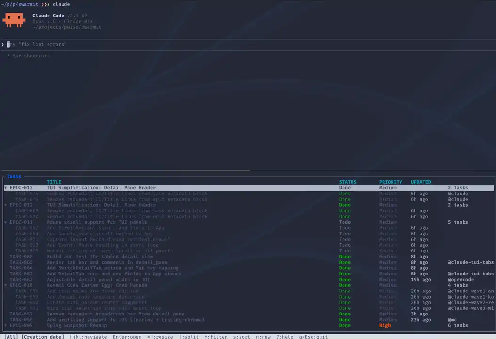

# Swarmit



**Persistent task coordination for AI coding agents.**

AI coding agents try to maintain context through markdown plans and limited subagent memory — but those are fragile, siloed, and invisible to other agents. Swarmit replaces that with a shared, persistent task board every agent reads and writes through the same CLI. One source of truth across sessions and agents.

Break a project into epics and tasks, set up dependency graphs, then let multiple agents pick up work in parallel — each one aware of what the others are doing. Come back tomorrow and the plan is still there, with full history of who did what.

---

## Why Swarmit

**Long-term planning.** Agents create epics with tasks, dependencies, and priorities that survive across sessions. Pick up where you left off — or let a fresh agent continue the work.

**Multi-agent collaboration.** Multiple agents claim tasks before starting, leave progress comments, and mark work done — all through the same CLI. No duplicate work, no stepping on each other.

**Full visibility.** A live terminal dashboard shows what's happening right now: who's working on what, what's blocked, what's done. Every mutation is recorded in an append-only event log with complete history.

**Agent-native.** JSON output on every command. Pipe-friendly. Comes with a Claude Code skill that teaches agents the workflow automatically.

```
  Agent A          Agent B          Agent C
    │                 │                │
    │  swarmit CLI    │  swarmit CLI   │  swarmit CLI
    └────────┬────────┘                │
             ▼                         │
       shared task state  ◄────────────┘
             │
             ▼
         swarmit TUI
    (live-refreshing dashboard
     you watch while agents run)
```

---

## Install

### Pre-built binaries

Download the latest release from [GitHub Releases](https://github.com/zeapo/swarmit/releases):

- **Linux x86_64**: `swarmit-linux-x86_64.tar.gz`
- **macOS ARM64**: `swarmit-macos-arm64.tar.gz`

```bash
# Example: macOS ARM64
tar xzf swarmit-macos-arm64.tar.gz
mv swarmit /usr/local/bin/
```

### From source

```bash
git clone https://github.com/zeapo/swarmit
cd swarmit
cargo install --path .
```

Requires Rust 1.80+.

---

## Quick start

```bash
# Initialize a project
swarmit init --name "My Project" --agent me

# Plan the work
swarmit epic create --title "Authentication" --agent me
swarmit task create --title "Implement login flow" --epic EPIC-001 --agent me
swarmit task create --title "Add session middleware" --epic EPIC-001 --agent me
swarmit link add --from TASK-001 --to TASK-002 --type blocks --agent me

# Agents claim before starting, comment as they go, done when finished
swarmit task claim TASK-002 --agent claude-1
swarmit comment add TASK-002 --body "OAuth flow implemented, tests passing" --agent claude-1
swarmit task done  TASK-002 --agent claude-1
```

All mutation commands require `--agent <ID>` (or `SWARMIT_AGENT` env var). Output is pretty-printed on a TTY and JSON when piped — useful for scripting and agent-to-agent communication.

---

## Claude Code plugin

The plugin teaches Claude Code agents to use swarmit instead of the built-in todo tools. Once installed, agents automatically:

- Check for existing tasks before creating new ones
- Create epics with dependency graphs for multi-step work
- Claim tasks before starting (prevents duplicate work)
- Leave progress comments visible in the TUI in real time
- Mark tasks done when finished — or blocked with an explanation
- Dispatch parallel subagents in waves based on the dependency graph

**Install:**

```
/plugin marketplace add zeapo/swarmit
/plugin install swarmit
```

Or copy the skill file manually into your `.claude/skills/` directory — see [`plugin/skills/swarmit/`](plugin/skills/swarmit/).

---

## CLI

### Command groups

| Command | Description |
|---------|-------------|
| `swarmit init` | Initialize a project in the current directory |
| `swarmit epic` | Create, list, show, update, delete epics |
| `swarmit task` | Create, list, show, update, claim, done, delete tasks |
| `swarmit link` | Add / remove / list typed relationships |
| `swarmit comment` | Add comments to any task |
| `swarmit insight` | Attach code insights to tasks |
| `swarmit log` | Inspect the history of all changes |
| `swarmit compact` | Prune and snapshot history |
| `swarmit project` | Show or update project metadata |
| `swarmit sync` | Regenerate markdown files from state |

### Common examples

```bash
# List all open tasks
swarmit task list --status todo

# Tasks for a specific epic, as JSON
swarmit task list --epic EPIC-001 --status todo --json

# Show task detail with relationships and comments
swarmit task show TASK-007

# Link tasks
swarmit link add --from TASK-001 --to TASK-002 --type blocks --agent me

# Add a progress comment
swarmit comment add TASK-001 --body "OAuth flow implemented, tests passing" --agent me

# Review recent activity
swarmit log --tail 20
```

Full reference: [`plugin/skills/swarmit/cli-reference.md`](plugin/skills/swarmit/cli-reference.md)

---

## Markdown materialization

Swarmit can export its state as markdown files — one file per epic and task. This is a
**downstream, one-way export**: swarmit writes markdown from its event log, never the reverse.
Editing the markdown files has no effect on swarmit state.

By default, auto-materialization is off. Enable it in your project config:

```bash
swarmit init --name "My Project" --auto-materialize --agent me
# or update an existing project:
swarmit project update --auto-materialize true --agent me
```

You can also run `swarmit sync` at any time to generate (or regenerate) all markdown:

```bash
swarmit sync                        # writes to .swarmit/state/ (default)
swarmit sync --path ./docs/tasks    # writes to a custom directory
```

---

## TUI

Run `swarmit` with no arguments in a TTY to open the live dashboard:

```bash
swarmit
```

The TUI watches for file changes and refreshes automatically as agents update state. Two-pane layout with collapsible epic groups, three detail tabs (description, comments, insights), and inline editing via `$EDITOR`.

Catppuccin theme with automatic light/dark detection:

```bash
SWARMIT_THEME=latte     swarmit   # light
SWARMIT_THEME=mocha     swarmit   # dark
SWARMIT_THEME=frappe    swarmit
SWARMIT_THEME=macchiato swarmit
```

### Key bindings

| Key | Action |
|-----|--------|
| `j`/`k` or `↑`/`↓` | Navigate list / scroll detail |
| `Enter` | Open detail pane |
| `Space` | Collapse / expand epic group |
| `Tab` | Cycle detail tabs |
| `h`/`l` or `←`/`→` | Cycle detail tabs |
| `Shift+H/J/K/L` | Switch pane focus |
| `n` | New task |
| `e` | Edit description in `$EDITOR` |
| `a` | Add comment in `$EDITOR` |
| `S` | Change task status |
| `E` | Change task epic |
| `f` | Filter |
| `s` | Sort |
| `r` | Refresh |
| `\|` | Toggle split direction |
| `=` / `-` | Resize detail pane |
| `?` | Help |
| `q` / `Esc` | Quit / back |

---

## What's in the box

- Epics and tasks with priority, assignee, and status
- Typed relationships between items (`blocks`, `blocked_by`, `parent`, `child`, `relates_to`, `duplicates`)
- Comments and code insights on any task
- Full history with `swarmit log`
- JSON output on every command — pipe-friendly for agents and scripts
- TUI with sort, filter, live refresh, inline editing, and resizable split panes
- Catppuccin theme with auto dark/light detection
- Claude Code skill file that wires everything together
- CI/CD with GitHub Actions — pre-built binaries for Linux and macOS

---

## Project layout

```
src/
  main.rs         # Binary entry point (mode detection)
  lib.rs          # Public API, re-exports
  models/         # Domain types: Task, Epic, ItemId, Status, etc.
  events/         # Event sourcing: Operation, append, locking
  state/          # Materializer, snapshot, index, markdown sync
  cli/            # CLI commands (clap)
  tui/            # Terminal UI (ratatui + crossterm)
plugin/
  skills/
    swarmit/      # Claude Code skill files
.swarmit/
  operations.log  # Append-only event log (source of truth)
  project.toml    # Project config
  state/          # Optional materialized markdown (downstream output)
```

---

## Development

```bash
cargo build          # Build all crates
cargo test           # Run all tests
cargo run -- --help  # CLI help
```

Tests use `tempfile` for isolated directories — no global state.

---

## License

MIT
